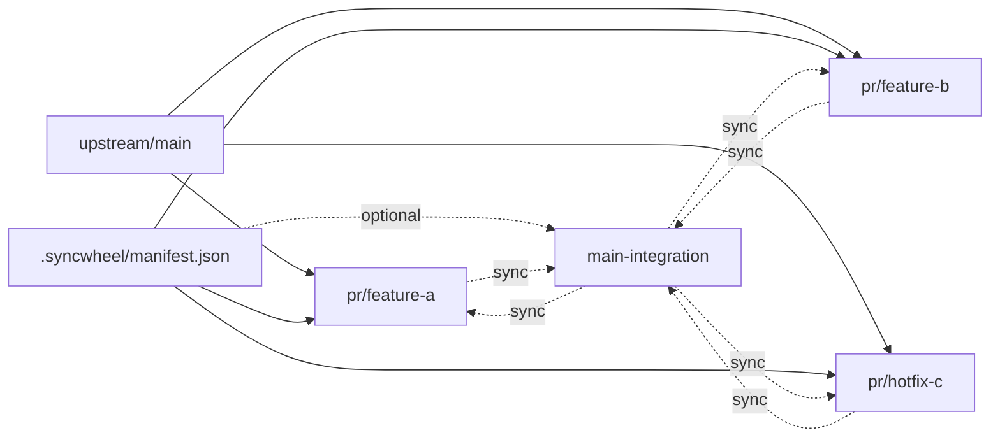

# syncwheel

Keep many long-lived pull requests clean, rebuildable, and publishable from one
manifest.

Current version: `0.13.0`

`syncwheel` is a small CLI and workflow model for maintainers who carry several
PR branches against an upstream repository and need those branches to stay
under control over time.

It is especially useful when you:

- keep many open PRs alive while upstream keeps moving
- maintain a fork with clean review branches and a combined local runtime branch
- need to rebuild PR branches deterministically instead of hand-rebasing them
- work across multiple devices or AI agents without one checkout becoming the
  hidden source of truth
- want branch recovery to follow a manifest, not memory

`integration/*` is **recommended**, not mandatory.

You can use syncwheel in two modes:
- **PR-only mode**: manage and validate PR stacks without an integration branch
- **Integration mode**: also maintain a combined branch to test multiple in-flight PRs together

## Why Syncwheel Exists

Git can tell you what happened. It cannot reliably tell you which commits belong
to logical PR `feature-a`, which commits are temporary integration-only work,
or how to rebuild ten open PRs after upstream changed.

Syncwheel adds that missing control plane:

- one manifest declares commit ownership
- each stack maps to one PR branch
- integration is a disposable projection of the manifest
- `reconcile` compares local branches, remote tips, and manifest projections
- humans, scripts, and AI agents can all run the same lifecycle

The practical result is that a maintainer can keep many PRs open without
turning branch history into tribal knowledge.

## 30-Second Workflow

```bash
python3 scripts/syncwheel.py reconcile
python3 scripts/syncwheel.py reconcile --apply --worktree-root ../syncwheel-worktrees
python3 scripts/syncwheel.py reconcile --apply --push --worktree-root ../syncwheel-worktrees
```

Default behavior is conservative:

- `reconcile` is dry-run by default
- `--apply` is required before branches are rebuilt
- `--push` is required before remote branches move
- `reconcile --push` uses `--force-with-lease` by default, because managed
  branches are often rewritten by deterministic rebuilds
- if a remote managed branch already matches the manifest projection,
  `reconcile --apply` aligns the local branch to that remote instead of
  rebuilding new replacement commits
- pass `--align-local-to-remote` when local and remote both already match the
  manifest projection but Git history still shows ahead/behind; this normalizes
  the local branch to the published remote history without rebuilding or
  touching the manifest

Use `--no-force-with-lease` only when a normal push is intentionally required.

## Worktree-first model

Syncwheel is fundamentally built around Git worktrees. The safest default is:

- keep the primary working checkout on the shared integration branch
- use one worktree per PR branch when rebuilding or validating PR state
- optionally keep a separate administrative checkout for manifest-only work

This keeps branch mutation explicit and avoids losing your place in a normal
working checkout. For simpler human-operated workflows, `stack rebuild` and
`int rebuild` also support `--in-place`; in-place mode requires the current
checkout to already be on the target branch and to be clean before anything is
reset or replayed.

## System flow (visual)

syncwheel has four pieces:
- **base branch** (`upstream/main` or similar)
- **PR stacks** mapped to `pr/*` branches
- **manifest** (`.syncwheel/manifest.json`) as source of truth
- **integration branch** (`main-integration` by default) for combined testing



Practical meaning:
- PR branches are rebuilt from declared commit ownership
- integration (if used) is rebuilt from declared stack order
- one manifest keeps both sides aligned
- branch rebuilds create a backup branch first when the target branch already
  exists

### How it works in practice

- A **PR stack** is one logical change stream mapped to one `pr/*` branch with an explicit commit list.
- `stack sync`, `stack set`, and `stack add` update commit ownership without
  hand-editing SHA lists.
- `stack absorb` moves dirty or staged integration-branch changes into a stack
  branch, updates the manifest, and removes the absorbed patch from the
  integration checkout.
- `stack rebuild` rebuilds one PR branch from the manifest.
- `int rebuild` rebuilds integration from ordered stacks.
- `stack push` and `int push` wrap `git push`, with arbitrary Git arguments
  after `--`.
- `reconcile` is the preferred multi-device maintenance entrypoint: it compares
  manifest ownership, stack branches, integration, and remote tips; reports a
  dry-run plan by default; and can rebuild, update manifest SHAs, and push when
  explicitly run with `--apply` and `--push`.
- In multi-device workflows, `reconcile` converges toward a remote branch that
  already matches the manifest projection instead of rebuilding the same logical
  state into new SHAs on every device.
- `validate` and `plan` detect drift before branch mutation.
- validation also reports non-merge commits on integration that are not
  declared in any stack, so integration-only work cannot hide silently.
- update detection also works for normal branch checkouts and detached
  submodule-style installs.
- `integration.strategy` controls how integration is rebuilt:
  - `cherry-pick` replays every declared commit into one linear history.
  - `merge-stacks` merges each declared stack branch in manifest order with
    `--no-ff`, preserving an integration history made of merge commits.

## Who this is for

`syncwheel` is for teams or maintainers who have at least one of these conditions:
- active upstream + fork workflow, especially in open source
- multiple PR branches that must stay clean while development continues
- long-lived PRs that need regular rebuilds on top of a moving base branch
- an `integration/*` branch used as day-to-day runnable state
- multi-device or AI-agent workflows where no single checkout should be
  considered authoritative
- need for repeatable branch recovery that does not depend on memory

## Who this is not for

`syncwheel` is usually overkill when:
- you ship directly from one branch with short-lived PRs only
- your repo has no integration branch and no stacked branch maintenance
- your process does not need deterministic rebuilds from a declared manifest

## Three ways to use syncwheel

1. **Guide-first (manual execution)**  
   Use [docs/manual-git-flow.md](docs/manual-git-flow.md) as an operating
   playbook and run the underlying Git steps manually. This is possible, but
   cognitively heavier and easier to get wrong in complex branch graphs.

2. **Script-assisted (human-operated)**  
   Use the CLI for discovery, validation, manifest updates, branch rebuilds,
   Git wrappers, and push wrappers while a human decides what to run and when.
   This is a strong middle ground once the team knows the model well.

3. **AI-operated (recommended)**  
   Let an AI agent run the syncwheel flow through prompts, with a human supervising intent and approval boundaries. In practice this gives the best speed/consistency balance for ongoing maintenance.

## Install

No package install is required. The tool is a single Python script.

Requirements:
- Python 3.11+
- Git

## Self update, notifications, and AI-safe visibility

Syncwheel now includes a built-in install/update channel so humans and AI agents
can notice new releases instead of silently drifting.

- default mode: `notify`
- automatic notice is emitted on normal syncwheel usage when the local install is
  behind its upstream branch
- manual inspection:

```bash
python3 scripts/syncwheel.py self status
python3 scripts/syncwheel.py self check-update --fetch
```

- manual update:

```bash
python3 scripts/syncwheel.py self update
```

- update policy:

```bash
python3 scripts/syncwheel.py self mode notify
python3 scripts/syncwheel.py self mode auto
python3 scripts/syncwheel.py self mode off
```

`auto` tries a safe fast-forward self-update when a newer upstream version is
detected. If the syncwheel checkout is dirty or detached, syncwheel falls back
to a visible notice instead of mutating it unsafely.

## Installation and adoption modes

1. **Global toolkit (recommended)**
   - Clone `syncwheel` once in a stable location.
   - Run it against target repos via `-r/--repo` using either paths or aliases.
   - Best when you want one central install to keep updated.

2. **Git submodule**
   - Add `syncwheel` as a submodule inside each target repo.
   - Good when each project must pin an explicit syncwheel version.

3. **Vendored script**
   - Copy `scripts/syncwheel.py` into a project.
   - Fastest for experiments, but updates are manual.

## Repo aliases

You can register repo aliases and keep commands short.

```bash
python3 scripts/syncwheel.py repo add project ~/code/sample-project
python3 scripts/syncwheel.py repo ls
python3 scripts/syncwheel.py self status
python3 scripts/syncwheel.py self check-update --fetch
python3 scripts/syncwheel.py self update
python3 scripts/syncwheel.py self mode notify
python3 scripts/syncwheel.py status -r project --fetch
python3 scripts/syncwheel.py repo rm project
```

`-r/--repo` accepts both:
- a filesystem path
- a registered alias

Alias entries can also carry a default manifest path (useful for private/local manifests on public repos):

```bash
python3 scripts/syncwheel.py repo add service ~/code/sample-service \
  --manifest ~/.config/syncwheel/manifests/sample-service.json
python3 scripts/syncwheel.py repo set-manifest service ~/.config/syncwheel/manifests/sample-service.json
python3 scripts/syncwheel.py repo set-manifest service --clear
```

You can also set `SYNCWHEEL_REPO` when wrapping syncwheel from another project:

```bash
SYNCWHEEL_REPO=/path/to/repo python3 scripts/syncwheel.py check
```

## Manifest creation

Create the shared manifest with `init`:

```bash
python3 scripts/syncwheel.py init
```

Create a personal local manifest without copying or hand-writing JSON:

```bash
python3 scripts/syncwheel.py init --personal alice
```

This writes `.syncwheel/manifests/alice.local.json` and defaults its integration
branch to `integration/alice/main`. Use `-p alice` on later commands
when you want to target that personal manifest:

```bash
python3 scripts/syncwheel.py check -p alice
python3 scripts/syncwheel.py s new -p alice feature-a --branch pr/alice/feature-a --include-in-integration
python3 scripts/syncwheel.py s set -p alice feature-a origin/main..HEAD
```

Long names are still available: `stack create --personal alice` is equivalent.

To make a personal manifest the default for the current clone:

```bash
python3 scripts/syncwheel.py use alice
python3 scripts/syncwheel.py check
python3 scripts/syncwheel.py use --shared
```

`use alice` writes `.syncwheel/profile.local.json`, which should be ignored by
the host repository because it is local operator state.

## Stack metadata (optional)

Each stack can include optional `meta` fields so humans and AI can understand intent better.

Example:

```json
{
  "id": "endpoint-resolution-policy",
  "branch": "pr/endpoint-resolution-policy",
  "commits": ["abc1234"],
  "meta": {
    "purpose": "Endpoint policy and routing",
    "status": "active",
    "priority": "p1",
    "dependencies": [],
    "integrationPolicy": "required",
    "notes": "Keep in integration for runtime validation"
  }
}
```

## Quick start

### 1. Bootstrap or inspect a manifest

```bash
python3 scripts/syncwheel.py init
python3 scripts/syncwheel.py check
```

For a custom integration branch:

```bash
python3 scripts/syncwheel.py init --integration-branch integration/team-stack
```

Use `--stdout` only when you need to pipe the generated manifest instead of
writing it to `.syncwheel/manifest.json`.

### 2. Declare stack ownership

```bash
python3 scripts/syncwheel.py stack create feature-a --branch pr/feature-a --include-in-integration
python3 scripts/syncwheel.py stack sync feature-a
python3 scripts/syncwheel.py stack set feature-a origin/main..HEAD
python3 scripts/syncwheel.py stack add feature-a HEAD
```

Use `stack sync` when the branch already represents the intended PR stack. Use
`stack set` or `stack add` when you want to declare an explicit revision range
or append a new commit.

### 3. Absorb integration-first work into stacks

When the main checkout is on the integration branch, you can make and test
changes there first, then assign those changes to the PR stack that owns them:

```bash
python3 scripts/syncwheel.py stack absorb feature-a path/to/file.ts
python3 scripts/syncwheel.py stack absorb feature-a --staged
```

By default, `stack absorb` amends the stack branch tip, refreshes that stack's
manifest commits, and reverse-applies the absorbed patch from the integration
checkout. Pass `--no-amend -m "message"` when the absorbed change should become
a new stack commit. Use `--staged` after `git add -p` when one file contains
changes for multiple PR stacks.

### 4. Reconcile managed branches

Use `reconcile` as the normal maintenance entrypoint:

```bash
python3 scripts/syncwheel.py reconcile
python3 scripts/syncwheel.py reconcile --apply --worktree-root ../syncwheel-worktrees
python3 scripts/syncwheel.py reconcile --apply --push --worktree-root ../syncwheel-worktrees
```

`reconcile` fetches by default, classifies stack and integration drift, rebuilds
only branches that differ from the manifest projection unless `--rebuild all`
is passed, refreshes stack commit SHAs after rebuilds, rebuilds integration from
the current manifest, and uses Syncwheel push wrappers when `--push` is present.
The report also prints the current working tree status, including uncommitted
files, before validation and drift details so dirty checkouts are visible
without running a separate `git status`.
When the remote branch already matches the manifest projection, `reconcile`
aligns the local branch to the remote and does not update the manifest or push
new replacement commits.

When both local and remote match the manifest projection but have different Git
histories, `reconcile` reports no action by default. Pass
`--align-local-to-remote` to normalize the local branch tip to the remote ref so
plain Git status stops showing ahead/behind:

```bash
python3 scripts/syncwheel.py reconcile --apply --align-local-to-remote
```

`reconcile --push` uses `--force-with-lease` by default because rebuilt managed
branches commonly replace older remote history in multi-device workflows. Pass
`--no-force-with-lease` only when a normal push is intentionally required.

Use `--json` for automation, `--stack <id>` to limit stack work, `--remote` to
override the publication remote, and `--in-place-integration` only when the
current checkout is already on the clean integration branch and should be reset
as part of the reconcile.

### 5. Use lower-level commands when needed

`reconcile` is the preferred lifecycle command. The object/action commands are
still useful for targeted repair and inspection:

```bash
python3 scripts/syncwheel.py validate
python3 scripts/syncwheel.py plan --json
python3 scripts/syncwheel.py stack absorb feature-a path/to/file.ts
python3 scripts/syncwheel.py stack rebuild feature-a --worktree ../wt-pr-feature-a
python3 scripts/syncwheel.py stack push feature-a -- --force-with-lease
python3 scripts/syncwheel.py stack git feature-a --worktree ../wt-pr-feature-a -- status
python3 scripts/syncwheel.py int rebuild --worktree ../wt-integration
python3 scripts/syncwheel.py int push -- --force-with-lease
python3 scripts/syncwheel.py int git --auto-worktree -- status
python3 scripts/syncwheel.py int sync-status --json
```

Use `--dry-run` on rebuild and push commands to print commands without applying
them. If the remote integration branch already matches the manifest projection
and the local checkout is stale, `int align-remote` can align a clean local
integration checkout to the remote with a backup branch first.

### 6. Compare different integration compositions

When two devices or workstreams use different manifests and integration
branches, compare the manifests instead of merging their integration branches:

```bash
python3 scripts/syncwheel.py manifest compare --other-personal laptop --json
python3 scripts/syncwheel.py manifest compare --other-manifest ../other-manifest.json
```

The comparison reports shared stacks, stacks only present in one composition,
and shared stacks whose branch/base/commit list diverges.

### 6. Install local Git hooks

Syncwheel includes a pre-commit hook that runs the version-bump guard against
staged files. Enable the tracked hooks once per clone:

```bash
python3 scripts/syncwheel.py self install-hooks
```

After that, commits that stage release-relevant changes under `scripts/`,
`tests/`, or `githooks/` must also stage `VERSION`, `CHANGELOG.md`, and the
README current-version line.

`self status` reports whether the hooks are active in the current Syncwheel
installation. See [docs/manual-git-flow.md](docs/manual-git-flow.md) for the
raw Git equivalent of the Syncwheel lifecycle.

## Files

- `scripts/syncwheel.py`: main CLI
- `scripts/syncwheel-status.sh`: small compatibility wrapper
- `docs/`: human-readable workflow docs and guides
- `examples/manifest.example.json`: starter manifest
- `tests/`: unit tests and fixture repositories
- `VERSION`: current release version
- `CHANGELOG.md`: release notes

## Documentation map

- `docs/workflow.md`: concise workflow model
- `docs/core-procedure.md`: deterministic recovery procedure
- `docs/manual-git-flow.md`: raw Git equivalent of the Syncwheel lifecycle
- `docs/branch-model.md`: branch role model and safety defaults
- `docs/deterministic-model.md`: manifest semantics and validation contract
- `docs/ai-agents.md`: short AI behavior contract
- `docs/agent-procedure.md`: extended AI execution guidance
- `docs/workflow-longform.md`: long-form practical workflow guide
- `docs/public-article.md`: narrative article version for broader audiences

## CLI summary

```bash
python3 scripts/syncwheel.py --help
python3 scripts/syncwheel.py --version
python3 scripts/syncwheel.py init --help
python3 scripts/syncwheel.py check --help
python3 scripts/syncwheel.py status --help
python3 scripts/syncwheel.py validate --help
python3 scripts/syncwheel.py plan --help
python3 scripts/syncwheel.py reconcile --help
python3 scripts/syncwheel.py stack --help
python3 scripts/syncwheel.py int --help
python3 scripts/syncwheel.py stack rebuild --help
python3 scripts/syncwheel.py stack push --help
python3 scripts/syncwheel.py stack git --help
python3 scripts/syncwheel.py int rebuild --help
python3 scripts/syncwheel.py int push --help
python3 scripts/syncwheel.py int git --help
```

Common aliases:
- `check` -> `ck`
- `status` -> `st`
- `validate` -> `v`
- `plan` -> `pl`
- `reconcile` -> `rec`
- `stack` -> `s`
- `int` -> `i`
- `stack create` -> `s new`
- `stack rebuild` -> `s rb`
- `int rebuild` -> `i rb`
- `git` subcommands -> `g`
- `--personal` -> `-p`

## AI agent usage

Agents should not infer stack ownership from memory when the repository is meant to be maintained via `syncwheel`.

Recommended sequence:
1. `reconcile`
2. update the manifest with `stack sync`, `stack set`, or `stack add` if the
   dry-run report shows real ownership changes
3. `reconcile --apply --worktree-root <path>`
4. `reconcile --apply --push --worktree-root <path>`
   when the rebuilt managed branches should become the shared remote state
5. rerun `reconcile` or `check` and report remaining drift honestly

See [docs/ai-agents.md](docs/ai-agents.md).

## Manifest maintenance rule

When `.syncwheel/manifest.json` is the source of truth for exact stack commits,
do not try to make a manifest-editing commit describe itself inside that same
manifest revision.

Use this rule instead:
- stack commits describe product/runtime changes
- manifest edits and syncwheel-version bumps are control-plane metadata
- rebuild `pr/*` branches and integration from the manifest
- keep manifest-maintenance commits out of `integration.stacks`

For the operational flow, see [docs/core-procedure.md](docs/core-procedure.md).

## License

MIT
