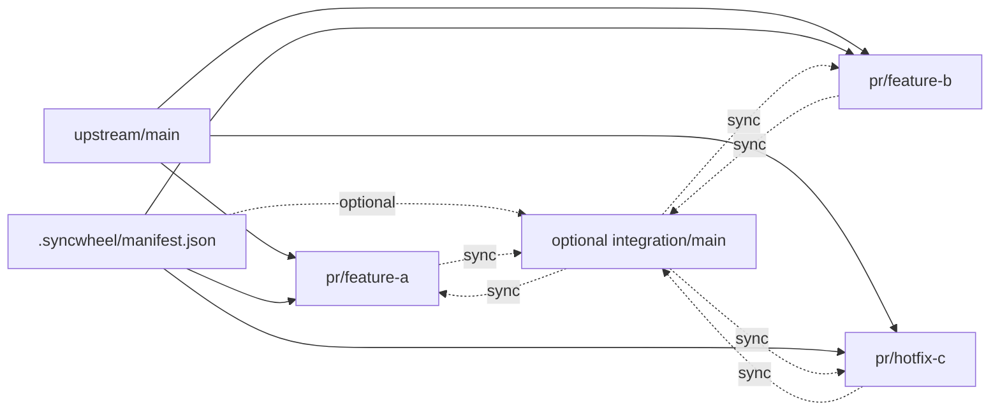

# syncwheel

Deterministic fork/upstream/integration maintenance for Git repositories.

`syncwheel` is a small CLI plus a documentation model for teams that:
- publish clean `pr/*` branches toward an original upstream repository
- optionally keep an `integration/*` branch for combined runtime testing
- want AI agents and shell automation to rebuild those branches repeatably

`integration/*` is **recommended**, not mandatory.

You can use syncwheel in two modes:
- **PR-only mode**: manage and validate PR stacks without an integration branch
- **Integration mode**: also maintain a combined branch to test multiple in-flight PRs together

## System flow (visual)

syncwheel has four pieces:
- **base branch** (`upstream/main` or similar)
- **PR stacks** mapped to `pr/*` branches
- **manifest** (`.syncwheel/manifest.json`) as source of truth
- **optional integration branch** (`integration/*`) for combined testing



Practical meaning:
- PR branches are rebuilt from declared commit ownership
- integration (if used) is rebuilt from declared stack order
- one manifest keeps both sides aligned

### How it works in practice

- A **PR stack** is one logical change stream mapped to one `pr/*` branch with an explicit commit list.
- `materialize-pr` rebuilds one PR branch from the manifest.
- `materialize-integration` rebuilds integration from ordered stacks (only in integration mode).
- `validate` and `plan` detect drift before branch mutation.

## Who this is for

`syncwheel` is for teams or maintainers who have at least one of these conditions:
- active upstream + fork workflow
- multiple PR branches that must stay clean while development continues
- an `integration/*` branch used as day-to-day runnable state
- need for repeatable branch recovery that does not depend on memory

## Who this is not for

`syncwheel` is usually overkill when:
- you ship directly from one branch with short-lived PRs only
- your repo has no integration branch and no stacked branch maintenance
- your process does not need deterministic rebuilds from a declared manifest

## Three ways to use syncwheel

1. **Guide-first (manual execution)**  
   Use the docs as an operating playbook and run Git steps manually. This is possible, but cognitively heavier and easier to get wrong in complex branch graphs.

2. **Script-assisted (human-operated)**  
   Use the CLI for discovery, validation, and materialization, while a human decides what to run and when. This is a strong middle ground once the team knows the model well.

3. **AI-operated (recommended)**  
   Let an AI agent run the syncwheel flow through prompts, with a human supervising intent and approval boundaries. In practice this gives the best speed/consistency balance for ongoing maintenance.

## Install

No package install is required. The tool is a single Python script.

Requirements:
- Python 3.11+
- Git

## Installation and adoption modes

1. **Global toolkit (recommended)**
   - Clone `syncwheel` once in a stable location.
   - Run it against target repos via `-r/--repo` using either paths or aliases.
   - Best when you want one central install to keep updated.

2. **Git submodule**
   - Add `syncwheel` as a submodule inside each target repo.
   - Good when each project must pin an explicit syncwheel version.

3. **Vendored script**
   - Copy `scripts/syncwheel.py` into a project.
   - Fastest for experiments, but updates are manual.

## Repo aliases

You can register repo aliases and keep commands short.

```bash
python3 scripts/syncwheel.py repo add yalc ~/code/nestjs-yalc
python3 scripts/syncwheel.py repo ls
python3 scripts/syncwheel.py status -r yalc --fetch
python3 scripts/syncwheel.py repo rm yalc
```

`-r/--repo` accepts both:
- a filesystem path
- a registered alias

## Quick start

### 1. Bootstrap a manifest

```bash
python3 scripts/syncwheel.py init --stdout > .syncwheel/manifest.json
```

Or copy the example:

```bash
mkdir -p .syncwheel
cp examples/manifest.example.json .syncwheel/manifest.json
```

### 2. Inspect current state

```bash
python3 scripts/syncwheel.py status --fetch
```

### 3. Validate manifest against Git

```bash
python3 scripts/syncwheel.py validate
python3 scripts/syncwheel.py plan --json
```

### 4. Rebuild one PR branch from the declared stack

Dry run:

```bash
python3 scripts/syncwheel.py materialize-pr feature-a --worktree ../wt-pr-feature-a
```

Apply:

```bash
python3 scripts/syncwheel.py materialize-pr feature-a --worktree ../wt-pr-feature-a --apply
```

### 5. Rebuild integration from declared stack order

Dry run:

```bash
python3 scripts/syncwheel.py materialize-integration --worktree ../wt-integration
```

Apply:

```bash
python3 scripts/syncwheel.py materialize-integration --worktree ../wt-integration --apply
```

## Files

- `scripts/syncwheel.py`: main CLI
- `scripts/syncwheel-status.sh`: small compatibility wrapper
- `docs/`: human-readable workflow docs and guides
- `examples/manifest.example.json`: starter manifest
- `tests/`: unit tests and fixture repositories

## Documentation map

- `docs/workflow.md`: concise workflow model
- `docs/core-procedure.md`: deterministic recovery procedure
- `docs/branch-model.md`: branch role model and safety defaults
- `docs/deterministic-model.md`: manifest semantics and validation contract
- `docs/ai-agents.md`: short AI behavior contract
- `docs/agent-procedure.md`: extended AI execution guidance
- `docs/workflow-longform.md`: long-form practical workflow guide
- `docs/public-article.md`: narrative article version for broader audiences

## CLI summary

```bash
python3 scripts/syncwheel.py --help
python3 scripts/syncwheel.py init --help
python3 scripts/syncwheel.py status --help
python3 scripts/syncwheel.py validate --help
python3 scripts/syncwheel.py plan --help
python3 scripts/syncwheel.py materialize-pr --help
python3 scripts/syncwheel.py materialize-integration --help
```

## AI agent usage

Agents should not infer stack ownership from memory when the repository is meant to be maintained via `syncwheel`.

Recommended sequence:
1. `status --fetch`
2. `validate`
3. `plan --json`
4. update the manifest if reality changed
5. `materialize-pr` and/or `materialize-integration`
6. rerun `validate`
7. report remaining drift honestly

See [docs/ai-agents.md](docs/ai-agents.md).

## License

MIT
