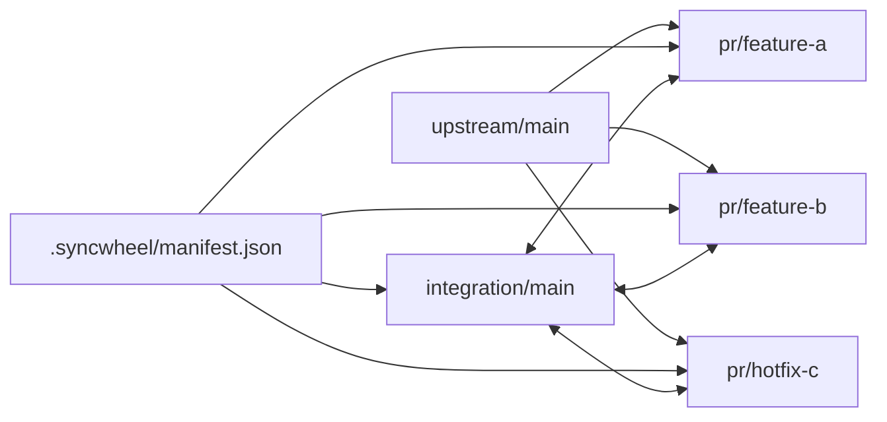

# syncwheel

Deterministic fork/upstream/integration maintenance for Git repositories.

`syncwheel` is a small CLI plus a documentation model for teams that:
- do day-to-day work on an `integration/*` branch
- publish clean `pr/*` branches toward an original upstream repository
- want AI agents and shell automation to rebuild those branches repeatably

## Why it exists

Git can tell you which commits are on a branch. What it cannot tell you with certainty is the intended ownership model, for example which commits are meant to travel together as one reviewable workstream.

In syncwheel, that workstream is called a **PR stack**:
- a named logical change set (feature, fix, refactor)
- mapped to one `pr/*` branch
- represented by an explicit commit list in the manifest

Without that declaration, ownership is heuristic. With that declaration, ownership is deterministic.

`syncwheel` makes that mapping explicit in `.syncwheel/manifest.json`, then validates and materializes branch state from it.

## Who this is for

`syncwheel` is for teams or maintainers who have at least one of these conditions:
- active upstream + fork workflow
- multiple PR branches that must stay clean while development continues
- an `integration/*` branch used as day-to-day runnable state
- need for repeatable branch recovery that does not depend on memory

## Who this is not for

`syncwheel` is usually overkill when:
- you ship directly from one branch with short-lived PRs only
- your repo has no integration branch and no stacked branch maintenance
- your process does not need deterministic rebuilds from a declared manifest

## Three ways to use syncwheel

1. **Guide-first (manual execution)**  
   Use the docs as an operating playbook and run Git steps manually. This is possible, but cognitively heavier and easier to get wrong in complex branch graphs.

2. **Script-assisted (human-operated)**  
   Use the CLI for discovery, validation, and materialization, while a human decides what to run and when. This is a strong middle ground once the team knows the model well.

3. **AI-operated (recommended)**  
   Let an AI agent run the syncwheel flow through prompts, with a human supervising intent and approval boundaries. In practice this gives the best speed/consistency balance for ongoing maintenance.

## Core model

Unless a repository documents a different rule:
- normal development happens on `integration/*`
- every persistent change on integration should also belong to a `pr/*` stack
- `pr/*` branches are review surfaces for upstream PRs
- long-lived integration-only product code is drift and should be surfaced

## Integration branch, explained

The `integration/*` branch is the branch where combined reality lives.

Use it to:
- run and test multiple in-flight changes together
- continue development without waiting for each upstream PR to merge
- detect cross-PR conflicts early, before review-time surprises

In syncwheel, synchronization is **bidirectional by design** (through explicit materialization):
- from declared stacks -> rebuild integration (`materialize-integration`)
- from declared stacks -> rebuild each PR branch (`materialize-pr`)

This gives you parallel PR development with a shared, testable branch that stays traceable.



Practical meaning of the arrows:
- integration can be rebuilt from the declared stack order
- PR branches can be rebuilt from the same declared commit ownership
- the manifest is the source of truth that keeps both sides aligned

## Install

No package install is required. The tool is a single Python script.

Requirements:
- Python 3.11+
- Git

## Quick start

### 1. Bootstrap a manifest

```bash
python3 scripts/syncwheel.py init --stdout > .syncwheel/manifest.json
```

Or copy the example:

```bash
mkdir -p .syncwheel
cp examples/manifest.example.json .syncwheel/manifest.json
```

### 2. Inspect current state

```bash
python3 scripts/syncwheel.py status --fetch
```

### 3. Validate manifest against Git

```bash
python3 scripts/syncwheel.py validate
python3 scripts/syncwheel.py plan --json
```

### 4. Rebuild one PR branch from the declared stack

Dry run:

```bash
python3 scripts/syncwheel.py materialize-pr feature-a --worktree ../wt-pr-feature-a
```

Apply:

```bash
python3 scripts/syncwheel.py materialize-pr feature-a --worktree ../wt-pr-feature-a --apply
```

### 5. Rebuild integration from declared stack order

Dry run:

```bash
python3 scripts/syncwheel.py materialize-integration --worktree ../wt-integration
```

Apply:

```bash
python3 scripts/syncwheel.py materialize-integration --worktree ../wt-integration --apply
```

## Files

- `scripts/syncwheel.py`: main CLI
- `scripts/syncwheel-status.sh`: small compatibility wrapper
- `docs/`: human-readable workflow docs and guides
- `examples/manifest.example.json`: starter manifest
- `tests/`: unit tests and fixture repositories

## Documentation map

- `docs/workflow.md`: concise workflow model
- `docs/core-procedure.md`: deterministic recovery procedure
- `docs/branch-model.md`: branch role model and safety defaults
- `docs/deterministic-model.md`: manifest semantics and validation contract
- `docs/ai-agents.md`: short AI behavior contract
- `docs/agent-procedure.md`: extended AI execution guidance
- `docs/workflow-longform.md`: long-form practical workflow guide
- `docs/public-article.md`: narrative article version for broader audiences

## CLI summary

```bash
python3 scripts/syncwheel.py --help
python3 scripts/syncwheel.py init --help
python3 scripts/syncwheel.py status --help
python3 scripts/syncwheel.py validate --help
python3 scripts/syncwheel.py plan --help
python3 scripts/syncwheel.py materialize-pr --help
python3 scripts/syncwheel.py materialize-integration --help
```

## AI agent usage

Agents should not infer stack ownership from memory when the repository is meant to be maintained via `syncwheel`.

Recommended sequence:
1. `status --fetch`
2. `validate`
3. `plan --json`
4. update the manifest if reality changed
5. `materialize-pr` and/or `materialize-integration`
6. rerun `validate`
7. report remaining drift honestly

See [docs/ai-agents.md](docs/ai-agents.md).

## License

MIT
