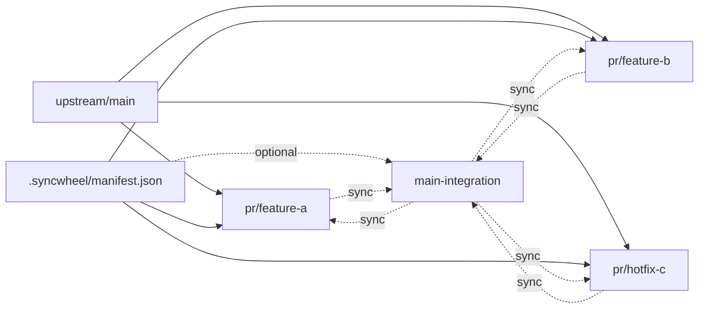

# syncwheel

Keep many long-lived pull requests clean, rebuildable, and publishable from one
manifest.

Current version: `0.38.1`

`syncwheel` is a small CLI and workflow model for maintainers who carry several
PR branches against an upstream repository and need those branches to stay
under control over time.

It is especially useful when you:

- keep many open PRs alive while upstream keeps moving
- maintain a fork with clean review branches and a combined local runtime branch
- need to rebuild PR branches deterministically instead of hand-rebasing them
- want to send several pull requests while working in a single checkout, without
  a worktree per branch
- need to own a commit before you know which pull request it belongs to
- need a repeatable branch that combines selected feature stacks for a shared
  or temporary deployment flow
- work across multiple devices or AI agents without one checkout becoming the
  hidden source of truth
- want branch recovery to follow a manifest, not memory

`integration/*` is **recommended**, not mandatory.

You can use syncwheel in two modes:
- **PR-only mode**: manage and validate PR stacks without an integration branch
- **Integration mode**: also maintain a combined branch to test multiple in-flight PRs together

## Why Syncwheel Exists

Git can tell you what happened. It cannot reliably tell you which commits belong
to logical PR `feature-a`, which commits are temporary integration-only work,
or how to rebuild ten open PRs after upstream changed.

Syncwheel adds that missing control plane:

- one manifest declares commit ownership
- each stack maps to one PR branch
- integration is a disposable projection of the manifest
- deployment channels pin selected stack revisions into ordered, rebuildable
  branch compositions
- `reconcile` compares local branches, remote tips, and manifest projections
- humans, scripts, and AI agents can all run the same lifecycle

The practical result is that a maintainer can keep many PRs open without
turning branch history into tribal knowledge.

## 30-Second Workflow

```bash
python3 scripts/syncwheel.py repo tracking status
python3 scripts/syncwheel.py reconcile
python3 scripts/syncwheel.py resume
python3 scripts/syncwheel.py sync
python3 scripts/syncwheel.py publish
```

Default behavior is conservative:

- `reconcile` is the dry-run diagnostic entrypoint
- `check --strict` is the CI/readiness gate: warnings, undeclared stack-branch
  commits, or any planned action produce a non-zero exit
- `resume` is the dry-run recovery entrypoint for cross-device resume when
  integration contains unmapped commits that can be classified deterministically
- `ledger show` exposes Syncwheel's append-only event ledger and the current
  replayed state used for cross-machine recovery
- `sync` applies the safe local lifecycle without pushing
- `publish` applies the lifecycle and pushes managed branches
- lower-level `reconcile --apply` and `reconcile --apply --push` remain
  available for explicit scripting
- legacy manifests use `--force-with-lease` by default, because managed
  branches are often rewritten by deterministic rebuilds
- active-active version 2 or 3 manifests publish managed refs and state together
  with atomic, exact leases; unsupported remotes fail closed
- public coordination state uses typed canonical and publication remote roles,
  rejects ambiguous aliases that cannot be normalized safely, and makes a
  reused managed branch immediately supersede its old cleanup tombstone
- `repo tracking status` shows whether the manifest is `git-tracked`,
  `local-only`, or missing a persisted policy
- if a remote managed branch already matches the manifest projection,
  `sync`, `publish`, and `reconcile --apply` align the local branch to that
  remote instead of rebuilding new replacement commits
- pass `--no-align-local-to-remote` when you intentionally want to preserve a
  different local history for manual inspection

For legacy manifests, use `--no-force-with-lease` only when a normal push is
intentionally required.

`syncwheel_tracking=git-tracked` means `.syncwheel/manifest.json` should be
tracked by Git. `syncwheel_tracking=local-only` keeps Syncwheel metadata local
through `.git/info/exclude`. New managed worktrees default to repo-relative
`.syncwheel/wt/`.

## Active-active coordination

Manifest versions 2 and 3 can safely coordinate the same integration branch from
multiple independent devices or agents. New `git-tracked` manifests enable it
when their publication remote is configured:

```bash
syncwheel init --syncwheel-tracking git-tracked --publication-remote origin
syncwheel handoff
syncwheel publish
```

Existing version 1 manifests remain legacy. Upgrade deliberately with
`syncwheel coordination init --remote origin --apply`; opt out with
`syncwheel coordination disable --apply`. Active coordination requires atomic
push support and never falls back to serial pushes. See
[the active-active protocol](docs/design/active-active-coordination.md) for the
state model, lease handling, explicit merge acceptance, privacy contract, and
local cleanup safeguards.

When a managed branch is correct but coordination state recorded the wrong tip,
generate a digest-bound repair plan. The default backend remains non-mutating:

```bash
syncwheel coordination repair --ref refs/heads/main-integration > repair-plan.json
syncwheel coordination repair --apply --plan-file repair-plan.json
```

Apply rechecks the exact plan, ownership, pending merges, and every guarded ref.
Ordinary Git drops an unchanged no-op refspec, so there is no Git push fallback.
GitHub branch locks are not sufficient: administrators can bypass or change
them concurrently, so `github-lock` stops as unsupported before any state
update.

For the narrower case where the recorded and observed commits have exactly the
same tree, use `--freeze-backend tree-equivalent-state-cas` for both plan and
apply. This backend fetches and proves both commit trees, rechecks the state tip
and every managed ref, then pushes only an append-only state child under an
exact state-ref lease. It never updates the managed branch. Any different tree,
ownership uncertainty, ref drift, lease loss, or post-CAS drift stops
fail-closed; an accepted state child remains durable evidence even when the
post-verification reports failure.

When an actively managed ref has instead advanced through an exact, reviewed
fast-forward, use `--freeze-backend fast-forward-state-cas`. The plan binds the
recorded and observed tips and trees plus the complete bounded commit interval.
Apply repeats the ancestry and drift checks, then appends only state evidence
under the same exact state-ref lease. It never updates the managed branch and
refuses non-descendants, intervals above 1024 commits, plan drift, ownership
uncertainty, or concurrent ref changes.

When the remote state and a stale local manifest independently added stacks,
compose the proposals explicitly instead of weakening `stack push`:

```bash
syncwheel coordination compose \
  --stack new-stack \
  --known-base-state <state-sha> \
  --known-base-snapshot-digest <snapshot-digest> > compose-plan.json
syncwheel coordination compose --apply --plan-file compose-plan.json
```

Compose accepts only one local additive stack and additive remote stacks from
the exact known base. Existing records, shared defaults, integration strategy,
and membership order must be unchanged. Apply rederives the complete plan,
then atomically publishes only the new stack ref and an append-only partial
state child under exact leases. The integration ref is observed but never
updated; unmapped integration commits remain unmapped diagnostics. If remote
publication succeeds but local manifest adoption fails, replan produces an
adopt-only operation and never repeats the push.

## Common Short Flags

Long options remain stable; short flags are available for daily workflows:

| Short | Long | Where |
|---|---|---|
| `-r` | `--repo` | most repo commands |
| `-M` | `--manifest` | most repo commands |
| `-p` | `--personal` | most repo commands |
| `-j` | `--json` | status, plan, check, ledger, reconcile |
| `-F` | `--no-fetch` | check, reconcile, update/alignment flows |
| `-n` | `--dry-run` | rebuild, push, self update/hooks, align-remote |
| `-a` | `--apply` | reconcile and repo tracking set |
| `-P` | `--push` | reconcile |
| `-R` | `--remote` | reconcile, push, integration remote flows |
| `-W` | `--worktree-root` | init, reconcile, stack absorb |

Examples:

```bash
syncwheel status -f -j
syncwheel repo tracking set git-tracked -a
syncwheel reconcile -a -P -W .syncwheel/wt
syncwheel stack rebuild feature-a -n
```

## One checkout, worktrees on request

The safest default is:

- keep the primary working checkout on the shared integration branch
- rebuild and publish every PR branch from there, without checking it out
- optionally keep a separate administrative checkout for manifest-only work
- begin routine implementation, dependency installation, builds, and tests on integration
- create a desk only to resolve a conflict or validate a non-empty materialized stack
  when integration cannot safely run it

`stack rebuild` and `int rebuild` leave no worktree behind by default. Their
`auto` replay mode uses Git plumbing where Git supports it (2.38 or newer) and a
self-removing temporary worktree below that, the current checkout when it is
already on the target branch, and an existing worktree when the branch has one.
Pin a mode with `--replay-mode`, with `syncwheel replay-mode <mode>` for a
repo-local default, or with `defaults.replay_mode` in the manifest.

When another agent has explicitly locked or owns the primary checkout, continue
authoring only by asking for a governed lane. This is an explicit fallback, not
an automatic reaction to a lock:

```bash
syncwheel worktree open concise-change
syncwheel worktree open dependency-repair --full
```

`open` creates one clone-local, registered worktree below the configured
`syncwheel_worktree_root` and prints its path. A light lane is for authoring and
committing only; Syncwheel does not provision dependencies there. `--full` is
the explicit, bounded choice when dependency installation, builds, tests, or
debugging are necessary. It is a lifecycle declaration, not a sandbox: a raw
shell can still bypass it, so agents must keep that boundary in their procedure.

Each clone permits four active lanes. The local registry records the owner,
lease, base, branch, target stack, mode, and any recovery ref in Git's common
directory, never in the shared manifest. Use `--into <existing-stack>` when the
destination is already known. Otherwise, after committing, use the existing
`stack create`, `stack add`, or `stack capture-integration` workflow from a
different clean checkout. Once a stack owns every lane commit, Syncwheel anchors
the lane tip under `refs/syncwheel/recovery/lanes/...` before reaping the clean
worktree and local lane branch. A dirty, unavailable, outside-root, or current
directory lane is retained and reported; it is never removed automatically.

`status`, `check`, `handoff`, and `gc` include structured governed-worktree
diagnostics in JSON. Repo-aware terminal commands show actionable yellow
warnings for unfinished lanes when stderr is a TTY; `NO_COLOR` removes ANSI
color and JSON output remains free of ANSI sequences.

## Owning a commit before you know its PR

A commit made on the integration branch has to belong to a stack to reach the base branch. Until it
does, `validate` reports it as owned by nobody and the next integration rebuild drops it.

A draft stack closes that gap. It owns its commits like any other stack, but is forbidden from
becoming a pull request until you promote it:

```bash
syncwheel stack create --draft caching-experiment
syncwheel stack capture-integration caching-experiment HEAD
syncwheel stack promote caching-experiment --branch pr/caching
```

A draft refuses `stack push` to the target remote and names its state as the reason. Under
active-active coordination its source ref does publish to the coordination remote, so another clone
can rebuild the draft from the manifest alone. `stack demote` reverses the promotion, and refuses when
the stack already records an open pull request.

When `plan` finds integration commits belonging to no stack, it now names `capture-integration` into a
new draft as the remedy.

## Direct landing after local validation

`stack land` is the bounded alternative to a PR when a maintainer explicitly
asks to land an already-validated stack. It does not create a lane type, open a
PR, close a stack, deploy a channel, rewrite history, or mutate
`main-integration`. A preview rechecks the exact declared source projection,
combined integration projection, clean worktrees, dependency ancestry, remote
delivery tip, and (when enabled) active-active coordination. Its `planDigest`
binds a second `--apply` invocation; apply re-runs the same checks and pushes
only through an exact lease.

```bash
plan="$(syncwheel stack land caching-experiment --allow-direct --operation-id cache-land-01)"
digest="$(printf '%s' "$plan" | jq -r .planDigest)"
syncwheel stack land caching-experiment --allow-direct --operation-id cache-land-01 \
  --plan-digest "$digest" --apply
```

Repositories can opt in with a root `landing` policy. With no policy,
`--allow-direct` is required for the specific request. `mode: "direct"` permits
the normal path; `mode: "disabled"` retains the explicit bypass requirement.
The optional `checks` field is a small `all`/`any` tree of local commands,
receipt attestations, and PR-check route markers. A failed PR marker or a
protected remote ref stops and suggests `stack promote`; Syncwheel never opens
the PR itself. Every check override needs a reason and is retained in the
digest-bound plan and ledger receipt.

## Deployment channels

A channel pins an exact base revision plus a selected, ordered composition of
stacks pinned to exact branch revisions, commit lists, base provenance, and
`depends_on` closure/order. It is intentionally separate from:

- a stack, which owns one change stream;
- the integration branch, which represents the full current integration
  projection;
- a deployment, which is external environment state managed by CI/CD or
  another system.

Channels may be `shared` (for example a stable test input) or `ephemeral` (for
example a short-lived feature input with explicit expiry metadata). They do not
follow base or stack tips automatically: `channel refresh` updates pins
deliberately.

Explicit `depends_on` metadata is version 3-only. The reviewed v2-to-v3 channel
migration derives direct dependencies from existing stack base chains.

Every mutation previews a `channelPlan`; `--apply` requires its exact
`planDigest`. Durable operations record started/prepared/receipt evidence, and
publishing uses an exact lease. A channel-local resolution snapshot can capture
a resolved composition without rewriting its stacks; composition edits
invalidate it. Expiry never deletes a branch automatically; use `channel close`
for explicit cleanup.

Shared channels refuse publication when they contain draft stacks. Ephemeral
channels may include drafts for temporary testing. Under active-active
coordination, every channel uses the coordination remote so its branch and
coordination state publish atomically.

Publishing `channel/test` proves only that a specific Git composition is
available on that branch. It does **not** prove that an environment has deployed
or is healthy. See [deployment channels](docs/deployment-channels.md) for the
complete CLI, failure, and CI/CD boundary.

## System flow (visual)

syncwheel has six pieces:
- **base branch** (`upstream/main` or similar)
- **PR stacks** mapped to `pr/*` branches
- **manifest** (`.syncwheel/manifest.json`) as source of truth
- **integration branch** (`main-integration` by default) for combined testing
- optional **deployment channels** for pinned, selected compositions
- **ledger** (`.syncwheel/ledger/` for the shared manifest, or a sibling
  `<manifest-name>-ledger/` directory for personal and external manifests) as append-only
  operational history plus a replay checkpoint for cross-machine recovery


```mermaid
flowchart LR
    U[upstream/main]
    I[main-integration]
    P1[pr/feature-a]
    P2[pr/feature-b]
    P3[pr/hotfix-c]
    M[.syncwheel/manifest.json]

    U --> P1
    U --> P2
    U --> P3

    M --> P1
    M --> P2
    M --> P3
    M -. optional .-> I

    P1 -. sync .-> I
    P2 -. sync .-> I
    P3 -. sync .-> I
    I -. sync .-> P1
    I -. sync .-> P2
    I -. sync .-> P3
```

Practical meaning:
- PR branches are rebuilt from declared commit ownership
- integration (if used) is rebuilt from declared stack order
- one manifest keeps both sides aligned
- branch rebuilds create a backup branch first when the target branch already
  exists

### How it works in practice

- A **PR stack** is one logical change stream mapped to one `pr/*` branch with an explicit commit list.
- `stack sync`, `stack set`, and `stack add` update commit ownership without
  hand-editing SHA lists.
- `stack absorb` moves dirty or staged integration-branch changes into a stack
  branch, updates the manifest, and removes the absorbed patch from the
  integration checkout.
- `stack rebuild` rebuilds one PR branch from the manifest.
- `int rebuild` rebuilds integration from ordered stacks.
- `channel plan` previews channel materialization or publication; every channel
  mutation requires its exact digest, and `channel publish` uses an exact lease.
- `channel operation list/show/reconcile` exposes durable operation intent and
  observes uncertain outcomes without retrying a mutation.
- `stack push` and `int push` are targeted publication commands. On active
  version 2 or 3 manifests they publish a partial atomic state snapshot; legacy
  manifests retain the direct Git push wrapper and its optional arguments.
- `reconcile` is the preferred multi-device maintenance entrypoint: it compares
  manifest ownership, stack branches, integration, and remote tips; reports a
  dry-run plan by default; and can rebuild, update manifest SHAs, and push when
  explicitly run with `--apply` and `--push`.
- In multi-device workflows, `reconcile` converges toward a remote branch that
  already matches the manifest projection instead of rebuilding the same logical
  state into new SHAs on every device.
- `validate` and `plan` detect drift before branch mutation.
- validation also reports non-merge commits on integration that are not
  declared in any stack, so integration-only work cannot hide silently.
- update detection also works for normal branch checkouts and detached
  submodule-style installs.
- `integration.strategy` controls how integration is rebuilt:
  - `cherry-pick` replays every declared commit into one linear history.
  - `merge-stacks` merges each declared stack branch in manifest order with
    `--no-ff`, preserving an integration history made of merge commits.

## Who this is for

`syncwheel` is for teams or maintainers who have at least one of these conditions:
- active upstream + fork workflow, especially in open source
- multiple PR branches that must stay clean while development continues
- long-lived PRs that need regular rebuilds on top of a moving base branch
- an `integration/*` branch used as day-to-day runnable state
- multi-device or AI-agent workflows where no single checkout should be
  considered authoritative
- need for repeatable branch recovery that does not depend on memory

## Who this is not for

`syncwheel` is usually overkill when:
- you ship directly from one branch with short-lived PRs only
- your repo has no integration branch and no stacked branch maintenance
- your process does not need deterministic rebuilds from a declared manifest

## Three ways to use syncwheel

1. **Guide-first (manual execution)**  
   Use [docs/manual-git-flow.md](docs/manual-git-flow.md) as an operating
   playbook and run the underlying Git steps manually. This is possible, but
   cognitively heavier and easier to get wrong in complex branch graphs.

2. **Script-assisted (human-operated)**  
   Use the CLI for discovery, validation, manifest updates, branch rebuilds,
   Git wrappers, and push wrappers while a human decides what to run and when.
   This is a strong middle ground once the team knows the model well.

3. **AI-operated (recommended)**  
   Let an AI agent run the syncwheel flow through prompts, with a human supervising intent and approval boundaries. In practice this gives the best speed/consistency balance for ongoing maintenance.

## Install Methods

**CLI install**

```bash
uv tool install "git+https://github.com/NestDevLab/syncwheel"
syncwheel self status
```

**AI agent handoff**

Give an agent [`install.md`](install.md) when you want it to install Syncwheel, verify the CLI, inspect
a repository, and install the companion skill through Agentwheel.

```bash
curl -fsSL https://raw.githubusercontent.com/NestDevLab/syncwheel/main/install.md
```

**Companion skill**

When Agentwheel is available, install the Syncwheel skill into the runtime you are using:

```bash
agentwheel doctor --adapter codex --local --skill syncwheel --source github:NestDevLab/syncwheel
agentwheel install github:NestDevLab/syncwheel --adapter codex --local --skill syncwheel
```

## Install

Requirements:
- Python 3.11+
- Git
- uv 0.10+ for PATH-based installs

Recommended production install:

```bash
uv tool install "git+https://github.com/NestDevLab/syncwheel"
```

Development editable install from a local checkout:

```bash
uv tool install --editable .
```

Installer script:

```bash
scripts/install.sh
scripts/install.sh --editable /path/to/syncwheel
```

If `uv` is not installed, `scripts/install.sh` exits with instructions by
default. To explicitly let the installer bootstrap uv with the official
astral.sh installer, pass `--with-uv`.

Legacy checkout execution remains supported for pinned submodules, vendored
checkouts, and existing scripts:

```bash
python3 scripts/syncwheel.py --help
```

## Self update, notifications, and AI-safe visibility

Syncwheel now includes a built-in install/update channel so humans and AI agents
can notice new releases instead of silently drifting.

- default mode: `notify`
- automatic notice is emitted on normal syncwheel usage when the local install
  is behind the configured update source
- git-checkout installs update with the existing `git fetch` plus fast-forward
  merge flow
- uv tool installs update with `uv tool upgrade syncwheel`
- manual inspection:

```bash
syncwheel self status
syncwheel self check-update --fetch
```

When Agentwheel is on PATH, `self status` also checks whether the local Codex
runtime has the Syncwheel agent skill installed for the current repo. Install it
with:

```bash
agentwheel install github:NestDevLab/syncwheel --adapter codex --local --target-root /path/to/repo --skill syncwheel
```

If the `syncwheel` executable is not installed yet, run the same status checks
through the checkout script:

```bash
python3 /path/to/syncwheel/scripts/syncwheel.py self status
python3 /path/to/syncwheel/scripts/syncwheel.py self check-update --fetch
```

- manual update:

```bash
syncwheel self update
```

- update policy:

```bash
python3 scripts/syncwheel.py self mode notify
python3 scripts/syncwheel.py self mode auto
python3 scripts/syncwheel.py self mode off
```

`auto` tries a safe fast-forward self-update when a newer upstream version is
detected for git-checkout installs and runs the uv tool updater for uv installs.
If a git checkout is dirty or detached, syncwheel falls back to a visible notice
instead of mutating it unsafely.

For uv installs, `self check-update` reads the upstream `VERSION` file directly
instead of requiring a local git checkout. Advanced wrappers can override the
version source with `SYNCWHEEL_REMOTE_VERSION_URL` and the installer/update
source label with `SYNCWHEEL_UV_TOOL_SOURCE`.

## Installation and adoption modes

1. **uv production tool (recommended for normal hosts)**
   - Run `uv tool install "git+https://github.com/NestDevLab/syncwheel"`.
   - The `syncwheel` executable is placed on PATH when uv's tool bin directory
     is configured in the shell.
   - `syncwheel self update` uses uv to upgrade the installed tool.

2. **uv editable development tool (recommended for syncwheel development)**
   - Clone `syncwheel` once in a stable location.
   - Run `uv tool install --editable /path/to/syncwheel`.
   - The `syncwheel` executable reflects local source edits immediately.
   - `syncwheel self update` treats the checkout as a git install and uses the
     existing fast-forward flow against the clone's upstream.

3. **Git submodule**
   - Add `syncwheel` as a submodule inside each target repo.
   - Good when each project must pin an explicit syncwheel version.
   - Invoke it with `python3 path/to/syncwheel/scripts/syncwheel.py ...`.
   - Self-update status works for detached submodule-style checkouts; updating
     remains controlled by the parent repository's submodule policy.

4. **Vendored checkout or script**
   - Copy `scripts/syncwheel.py` into a project.
   - Fastest for experiments, but updates are manual.
   - `self status` reports `install_kind: script` when no git checkout or uv
     tool environment is detected.

## Repo aliases

You can register repo aliases and keep commands short.

```bash
python3 scripts/syncwheel.py repo add project ~/code/sample-project
python3 scripts/syncwheel.py repo ls
python3 scripts/syncwheel.py self status
python3 scripts/syncwheel.py self check-update --fetch
python3 scripts/syncwheel.py self update
python3 scripts/syncwheel.py self mode notify
python3 scripts/syncwheel.py status -r project --fetch
python3 scripts/syncwheel.py repo rm project
```

`-r/--repo` accepts both:
- a filesystem path
- a registered alias

Alias entries can also carry a default manifest path (useful for private/local manifests on public repos):

```bash
python3 scripts/syncwheel.py repo add service ~/code/sample-service \
  --manifest ~/.config/syncwheel/manifests/sample-service.json
python3 scripts/syncwheel.py repo set-manifest service ~/.config/syncwheel/manifests/sample-service.json
python3 scripts/syncwheel.py repo set-manifest service --clear
```

You can also set `SYNCWHEEL_REPO` when wrapping syncwheel from another project:

```bash
SYNCWHEEL_REPO=/path/to/repo python3 scripts/syncwheel.py check
```

## Manifest creation

Create the shared manifest with `init`:

```bash
python3 scripts/syncwheel.py init
```

Create a personal local manifest without copying or hand-writing JSON:

```bash
python3 scripts/syncwheel.py init --personal alice
```

This writes `.syncwheel/manifests/alice.local.json` and defaults its integration
branch to `integration/alice/main`. Its operational history is isolated in
`.syncwheel/manifests/alice.local-ledger/`. Use `-p alice` on later commands
when you want to target that personal manifest:

```bash
python3 scripts/syncwheel.py check -p alice
python3 scripts/syncwheel.py s new -p alice feature-a --branch pr/alice/feature-a
python3 scripts/syncwheel.py s set -p alice feature-a origin/main..HEAD
```

Long names are still available: `stack create --personal alice` is equivalent,
and `spoke` is a readable alias for `stack`. New manifests include every declared
stack in integration by default; use ordinary Git worktrees for work that should
not enter the Syncwheel lifecycle.

To make a personal manifest the default for the current clone:

```bash
python3 scripts/syncwheel.py use alice
python3 scripts/syncwheel.py check
python3 scripts/syncwheel.py use --shared
```

`use alice` writes `.syncwheel/profile.local.json`, which should be ignored by
the host repository because it is local operator state. `syncwheel replay-mode
<mode>` stores the repo-local default replay execution mode in the same file.

## Stack metadata (optional)

Each stack can include optional `meta` fields so humans and AI can understand intent better.

Example:

```json
{
  "id": "endpoint-resolution-policy",
  "branch": "pr/endpoint-resolution-policy",
  "commits": ["abc1234"],
  "meta": {
    "purpose": "Endpoint policy and routing",
    "status": "active",
    "priority": "p1",
    "dependencies": [],
    "integrationPolicy": "required",
    "notes": "Keep in integration for runtime validation"
  }
}
```

## Quick start

### 1. Bootstrap or inspect a manifest

```bash
python3 scripts/syncwheel.py init
python3 scripts/syncwheel.py check
```

For a custom integration branch:

```bash
python3 scripts/syncwheel.py init --integration-branch integration/team-stack
```

Use `--stdout` only when you need to pipe the generated manifest instead of
writing it to `.syncwheel/manifest.json`.

### 2. Declare stack ownership

```bash
python3 scripts/syncwheel.py stack create feature-a --branch pr/feature-a
python3 scripts/syncwheel.py stack sync feature-a
python3 scripts/syncwheel.py stack set feature-a origin/main..HEAD
python3 scripts/syncwheel.py stack add feature-a HEAD
```

Use `stack sync` when the branch already represents the intended PR stack. Use
`stack set` or `stack add` when you want to declare an explicit revision range
or append a new commit.

### 3. Absorb integration-first work into stacks

When the main checkout is on the integration branch, you can make and test
changes there first, then assign those changes to the PR stack that owns them:

```bash
python3 scripts/syncwheel.py stack absorb feature-a path/to/file.ts
python3 scripts/syncwheel.py stack absorb feature-a --staged
```

By default, `stack absorb` amends the stack branch tip, refreshes that stack's
manifest commits, and reverse-applies the absorbed patch from the integration
checkout. Pass `--no-amend -m "message"` when the absorbed change should become
a new stack commit. Use `--staged` after `git add -p` when one file contains
changes for multiple PR stacks.

Example: two files belong to `feature-a`, one file belongs to `feature-b`, and
one mixed file has hunks for both stacks:

```bash
python3 scripts/syncwheel.py stack absorb feature-a a1.ts a2.ts
python3 scripts/syncwheel.py stack absorb feature-b b1.ts
git add -p shared.ts
python3 scripts/syncwheel.py stack absorb feature-a --staged
git add -p shared.ts
python3 scripts/syncwheel.py stack absorb feature-b --staged
python3 scripts/syncwheel.py sync
```

### 4. Reconcile managed branches

Use `reconcile` as the normal maintenance entrypoint:

```bash
python3 scripts/syncwheel.py repo tracking status
python3 scripts/syncwheel.py reconcile
python3 scripts/syncwheel.py resume
python3 scripts/syncwheel.py sync
python3 scripts/syncwheel.py publish
```

`reconcile` fetches by default, classifies stack and integration drift, and
prints a dry-run plan. `sync` runs the same lifecycle locally: it rebuilds only
branches that differ from the manifest projection unless `--rebuild all` is
passed, refreshes stack commit SHAs after rebuilds, and rebuilds integration
from the current manifest. `publish` does the same local work and then uses
Syncwheel push wrappers for managed branches. The report also prints the
current working tree status, including uncommitted files, before validation and
drift details so dirty checkouts are visible without running a separate
`git status`.

`resume` is a thin recovery layer on top of `reconcile`. It pre-classifies
unmapped integration commits when ownership is deterministic, then runs the
normal reconcile planner on the resulting manifest. Use either form:

```bash
python3 scripts/syncwheel.py reconcile --mode resume
python3 scripts/syncwheel.py resume
```

In `resume` mode Syncwheel can:

- add an unmapped integration commit to an existing owning stack when exactly
  one owner is detected
- restore a previously known historical stack from the ledger when the branch
  still exists locally or remotely and ownership is unambiguous
- leave the commit in manual review when ownership is ambiguous

The shared manifest's ledger lives under `.syncwheel/ledger/`. Every other
manifest gets a sibling ledger derived from its filename, so parallel personal
or external manifests cannot overwrite one another's checkpoint. For example,
`.syncwheel/manifests/alice.local.json` uses
`.syncwheel/manifests/alice.local-ledger/`, while
`docs/syncwheel/glow-portals-manifest.json` uses
`docs/syncwheel/glow-portals-ledger/`.

Each ledger root contains:

- `events/000001.jsonl`, `000002.jsonl`, ... contain append-only event segments
- `checkpoints/latest.json` contains the replayed current state for fast reads

Use this to inspect the current replayed ledger state:

```bash
python3 scripts/syncwheel.py ledger show
python3 scripts/syncwheel.py ledger show --json
```

When integration contains non-merge commits that are not declared in any stack,
`check` and `reconcile` print commit-level guidance: short SHA, subject, touched
files, local and remote branches containing the commit, likely stack owners, and
suggested next commands such as `syncwheel stack add <stack> <sha>` followed by
`syncwheel reconcile`. This keeps the common integration-first repair path
inside Syncwheel instead of requiring separate `git log`, `git show`, and
`git branch --contains` commands.

When the remote branch already matches the manifest projection, `sync`,
`publish`, and `reconcile --apply` align the local branch to the remote and do
not update the manifest or push new replacement commits. Pass
`--no-align-local-to-remote` when you intentionally want to preserve a different
local history for manual inspection:

```bash
python3 scripts/syncwheel.py sync --no-align-local-to-remote
```

Legacy `publish` and `reconcile --push` use `--force-with-lease` by default
because rebuilt managed branches commonly replace older remote history in
multi-device workflows. Active version 2 or 3 manifests instead use the coordinated
atomic publisher and reject manual force, lease, or remote overrides.

Use `--json` for automation, `--stack <id>` to limit stack work, `--remote` to
override the publication remote, and `--in-place-integration` only when the
current checkout is already on the clean integration branch and should be reset
as part of the reconcile.

### 5. Use lower-level commands when needed

`reconcile` is the preferred lifecycle command. The object/action commands are
still useful for targeted repair and inspection:

```bash
python3 scripts/syncwheel.py validate
python3 scripts/syncwheel.py plan --json
python3 scripts/syncwheel.py stack absorb feature-a path/to/file.ts
python3 scripts/syncwheel.py stack rebuild feature-a --worktree ../wt-pr-feature-a
python3 scripts/syncwheel.py stack push feature-a
python3 scripts/syncwheel.py stack git feature-a --worktree ../wt-pr-feature-a -- status
python3 scripts/syncwheel.py int rebuild --worktree ../wt-integration
python3 scripts/syncwheel.py int push
python3 scripts/syncwheel.py int git --auto-worktree -- status
python3 scripts/syncwheel.py int sync-status --json
```

Use `--dry-run` on rebuild and push commands to print commands without applying
them. If the remote integration branch already matches the manifest projection
and the local checkout is stale, `int align-remote` can align a clean local
integration checkout to the remote with a backup branch first.

### 6. Compare different integration compositions

When two devices or workstreams use different manifests and integration
branches, compare the manifests instead of merging their integration branches:

```bash
python3 scripts/syncwheel.py manifest compare --other-personal laptop --json
python3 scripts/syncwheel.py manifest compare --other-manifest ../other-manifest.json
```

The comparison reports shared stacks, stacks only present in one composition,
and shared stacks whose branch/base/commit list diverges.

### 6. Guard managed refs and the primary checkout

Inspect or explicitly manage the repository-local, composable hook bundle:

```bash
syncwheel hooks status
syncwheel hooks install
syncwheel hooks install --apply
syncwheel hooks remove
syncwheel hooks remove --disable --reason "external contribution clone"
syncwheel hooks remove --disable --reason "external contribution clone" --apply
```

The `pre-push` guard derives guarded refs from the manifest and published coordination state,
including integration, stack and draft sources, channels, coordination state, an
owned journal branch, and the delivery branches that only `stack land` may publish.
It blocks direct, aliased, multi-ref, delete, force, and `HEAD:<managed>` pushes,
then names the corresponding Syncwheel publisher. Existing
hooks are chained and restored on removal; `core.hooksPath` is honored.

The same bundle installs `post-checkout` and `pre-commit` guards for the primary
checkout. A switch away from the manifest integration branch returns a visible
failure after Git completes the switch; the following commit is blocked. Dedicated
feature worktrees remain valid. The checkout hook cannot undo Git's completed branch
switch, so restore a mismatched checkout losslessly rather than resetting dirty work.

For `git-tracked` repositories the bundle is required by default. Every normal
repo-aware Syncwheel command, including `repo tracking status`, `validate`, and
`status`, checks and converges the bundle before continuing. Initialization and a
transition to `git-tracked` converge it in the same command. Explicit `hooks
status|install|remove` lifecycle commands remain observational or plan-first so they
can inspect and administer an absent bundle; the generated hook callbacks are also
excluded to prevent recursion. Existing non-Syncwheel hooks are chained and restored
on removal. `local-only` contribution clones remain opt-in. The only escape hatch is
a persisted clone-local disable with a non-empty reason, which stays visible in
validation.

Syncwheel publishers use a short-lived, single-use authorization scoped to the
remote and allowed destination refset.

These hooks are local safety rails, not a security boundary. `--no-verify`, deleting
the hooks, or operating from a clone before its first normal Syncwheel command can
bypass them.
See [the managed repository guard design](docs/design/managed-ref-guard.md)
for server-side hardening options.

### 7. Install development Git hooks

Syncwheel includes a pre-commit hook that runs the version-bump guard against
staged files. Enable the tracked hooks once per clone:

```bash
python3 scripts/syncwheel.py self install-hooks
```

After that, the hook renders the two website version labels from `VERSION` and
stops once when `docs/index.html` needs to be reviewed and staged. Commits that
stage release-relevant changes under `scripts/`, `tests/`, or `githooks/` must
also stage `VERSION`, `CHANGELOG.md`, and the README current-version line. CI
checks that the committed static site matches `VERSION`.

Run the same deterministic website render directly with:

```bash
python3 docs/sync_version.py
```

`self status` reports whether the hooks are active in the current Syncwheel
installation. See [docs/manual-git-flow.md](docs/manual-git-flow.md) for the
raw Git equivalent of the Syncwheel lifecycle.

## Files

- `scripts/syncwheel.py`: main CLI
- `scripts/syncwheel_revision_provider.py`: strict Agentwheel revision-provider protocol
- `scripts/syncwheel-status.sh`: small compatibility wrapper
- `docs/`: human-readable workflow docs and guides
- `docs/sync_version.py`: renders the checked-in website version from `VERSION`
- `examples/manifest.example.json`: starter manifest
- `tests/`: unit tests and fixture repositories
- `VERSION`: current release version
- `CHANGELOG.md`: release notes

## Documentation map

- `install.md`: AI-agent handoff for installing Syncwheel and the companion skill
- `AGENT.md`: concise operating guide for AI agents
- `llms.txt`: LLM-oriented map of the public docs
- `docs/workflow.md`: concise workflow model
- `docs/core-procedure.md`: deterministic recovery procedure
- `docs/manual-git-flow.md`: raw Git equivalent of the Syncwheel lifecycle
- `docs/revision-provider.md`: Agentwheel revisioning protocol and recovery contract
- `docs/branch-model.md`: branch role model and safety defaults
- `docs/deterministic-model.md`: manifest semantics and validation contract
- `docs/design/active-active-coordination.md`: active-active publication and recovery protocol
- `docs/deployment-channels.md`: pinned channel model, CLI, receipts, and CI/CD boundary
- `docs/ai-agents.md`: short AI behavior contract
- `docs/agent-procedure.md`: extended AI execution guidance
- `docs/workflow-longform.md`: long-form practical workflow guide
- `docs/public-article.md`: narrative article version for broader audiences

## CLI summary

```bash
python3 scripts/syncwheel.py --help
python3 scripts/syncwheel.py --version
python3 scripts/syncwheel.py init --help
python3 scripts/syncwheel.py coordination --help
python3 scripts/syncwheel.py handoff --help
python3 scripts/syncwheel.py revision-provider --help
python3 scripts/syncwheel.py gc --help
python3 scripts/syncwheel.py worktree --help
python3 scripts/syncwheel.py check --help
python3 scripts/syncwheel.py status --help
python3 scripts/syncwheel.py validate --help
python3 scripts/syncwheel.py plan --help
python3 scripts/syncwheel.py reconcile --help
python3 scripts/syncwheel.py ledger show --help
python3 scripts/syncwheel.py resume --help
python3 scripts/syncwheel.py sync --help
python3 scripts/syncwheel.py publish --help
python3 scripts/syncwheel.py journal status --help
python3 scripts/syncwheel.py journal snapshot --help
python3 scripts/syncwheel.py journal publish --help
python3 scripts/syncwheel.py journal schedule --help
python3 scripts/syncwheel.py channel --help
python3 scripts/syncwheel.py channel contract
python3 scripts/syncwheel.py channel operation --help
python3 scripts/syncwheel.py stack --help
python3 scripts/syncwheel.py int --help
python3 scripts/syncwheel.py stack rebuild --help
python3 scripts/syncwheel.py stack push --help
python3 scripts/syncwheel.py stack git --help
python3 scripts/syncwheel.py int rebuild --help
python3 scripts/syncwheel.py int push --help
python3 scripts/syncwheel.py int git --help
```

## Journal repositories

Set `repository_mode` to `journal` for a single-branch repository that records
an allowlisted working tree without PR stacks or integration. The manifest's
`journal` object declares `branch`, `remote`, `include`, `exclude`,
`max_file_bytes`, and an optional `interval` (default `30m`).

```bash
syncwheel journal status
syncwheel journal snapshot            # plan
syncwheel journal snapshot --apply    # locked temporary-index commit
syncwheel journal publish             # plan snapshot and exact-lease push
syncwheel journal publish --apply
syncwheel journal schedule install    # plan a Linux systemd user timer
syncwheel journal schedule install --apply
```

Journal snapshots refuse a dirty real index, sensitive paths, oversized files,
and high-confidence secrets. Publication stops on remote-ahead, divergence, or
lease loss; it never merges, resets, rebases, or force-updates a remote.

Common aliases:
- `check` -> `ck`
- `status` -> `st`
- `validate` -> `v`
- `plan` -> `pl`
- `reconcile` -> `rec`
- `channel` -> `ch`
- `stack` -> `s`, `spoke`
- `int` -> `i`
- `stack create` -> `s new`
- `stack rebuild` -> `s rb`
- `int rebuild` -> `i rb`
- `git` subcommands -> `g`
- `--personal` -> `-p`

## AI agent usage

Agents should not infer stack ownership from memory when the repository is meant to be maintained via `syncwheel`.

Recommended sequence:
1. `repo tracking status`
2. `handoff` for an active-active manifest, otherwise `reconcile`
3. update the manifest with `stack sync`, `stack set`, or `stack add` if the
   dry-run report shows real ownership changes
4. `sync`
5. `publish`
   when the rebuilt managed branches should become the shared remote state
6. rerun `reconcile` or `check` and report remaining drift honestly

See [docs/ai-agents.md](docs/ai-agents.md).

## Manifest maintenance rule

When `.syncwheel/manifest.json` is the source of truth for exact stack commits,
do not try to make a manifest-editing commit describe itself inside that same
manifest revision.

Use this rule instead:
- stack commits describe product/runtime changes
- manifest edits and syncwheel-version bumps are control-plane metadata
- rebuild `pr/*` branches and integration from the manifest
- keep manifest-maintenance commits out of `integration.stacks`

For the operational flow, see [docs/core-procedure.md](docs/core-procedure.md).

## License

MIT
