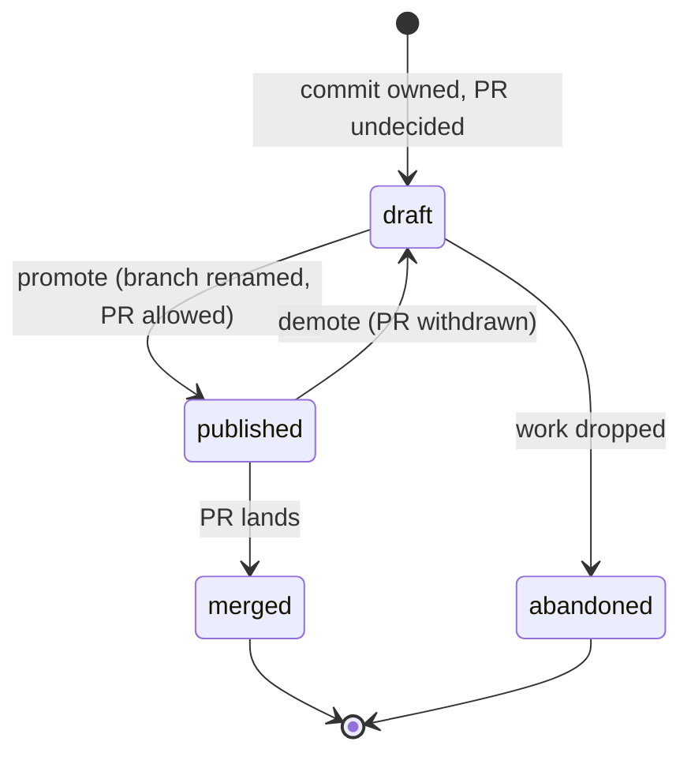

# Syncwheel: draft stacks

Status: proposal. Written against Syncwheel 0.23.0.

## Purpose

Let a stack own commits before a pull request exists for them. Today a stack is
born public: it presumes a PR branch and a final shape. Work that has not reached
that point has no home inside Syncwheel, so exactly during the messiest phase —
integration-first commits whose owning PR is not yet decided — ownership and
determinism are lost.

The key distinction this proposal introduces is **source branch vs PR branch**. A
draft stack is *not published*; it is never *without a branch*. The branch is the
cheap, private part, and it is what lets a commit be owned and rebuilt
deterministically. The PR is the expensive, public part, and is what gets deferred.

## Problem

`defaults.integration_membership: required` means every declared stack must appear
in `integration.stacks`, and the documented doctrine is that work not ready for the
Syncwheel lifecycle stays in a plain Git worktree — outside the manifest. There is
no state in between.

### Defect 1 — no state between "unmapped commit" and "PR stack"

An integration commit that belongs to no declared stack is reported as a warning
plus a `classify_integration_commits` plan action (`scripts/syncwheel.py:3653`).
Syncwheel can identify the commit but cannot decide its owner, and the only way to
give it one is to declare a full stack, which forces a PR branch name and an
assumed final shape. If the commit is left unclassified it does not merely sit
there: the next `int rebuild` reprojects integration from the manifest and the
commit is gone from the branch.

Note that unmapped classification already compares patch-ids as well as SHAs
(`scripts/syncwheel.py:3586`). That is diagnostics, not anchoring — it never
proves a declared commit is still contained anywhere.

### Defect 2 — a branchless stack is tolerated but is not a concept

A stack whose branch does not exist locally produces a warning, not an error, and
the `missing_from_branch` checks are skipped (`scripts/syncwheel.py:3549`). This
makes a "branchless" stack look viable. It is not a stable state:

- a normal `reconcile` sees `local_exists: false`, plans `rebuild_stack` with
  reason `local_branch_missing` (`scripts/syncwheel.py:5148`, `:5259`), creates the
  branch from `stack.base`, cherry-picks the declared commits and — with the
  default `update_manifest=true` — rewrites `stack.commits` to the new SHAs;
- `integration.strategy: merge-stacks` fails outright, because the rebuild merges
  `stack['branch']` (`scripts/syncwheel.py:4026`).

So a missing branch today means "not materialized yet", and Syncwheel cannot tell
it apart from "missing by mistake".

### Defect 3 — between `int rebuild` and the next `reconcile`, commits hang on recovery refs

`int rebuild` rebuilds integration and does not touch the manifest
(`scripts/syncwheel.py:5791`). The replay can produce new SHAs. For a stack with no
branch, the originally declared SHAs then survive only in the `backup/*` branch
and the reflog, which are recovery artifacts, not a durable record of ownership.
With `--rebuild none` nothing re-materializes them at all.

## Goals / Non-goals

Goals:

- a commit can be owned by a stack from the moment it exists, before any PR;
- integration remains a complete, verifiable projection of the manifest at all
  times, with no unowned commits parked in it;
- ownership survives an integration rebuild without depending on recovery refs;
- the state is shareable with other agents and machines, not valid only in the
  clone that produced it.

Non-goals:

- stacks with no Git ref (see Rejected alternatives);
- changing how PRs are created, reviewed, or merged;
- exposing pre-PR work to the forge. A draft stack is never published to a forge
  adapter: a pull request that does not exist cannot be a source of truth.

## Design

### Stack states

`state` becomes an explicit stack field.

| State | Meaning | In `integration.stacks` | Source ref | Push to target remote | Forge visible |
|---|---|---|---|---|---|
| `draft` | owned, not proposed | yes | required | refused | no |
| `published` | has, or is ready for, a PR | yes | required | allowed | yes |
| `merged` | absorbed by the base | no (closed) | reapable | n/a | historical |
| `abandoned` | dropped | no (closed) | reapable until GC | refused | no |

`draft` and `published` are both real stacks and both belong in
`integration.stacks`, which keeps `integration_membership: required` meaningful.
`merged` and `abandoned` are removed from the list by `stack close` / `stack
abandon`.

### Manifest schema additions

```json
{
  "id": "customer-data-exploration",
  "state": "draft",
  "branch": "syncwheel/draft/customer-data-exploration",
  "base": "origin/main",
  "publication": { "enabled": false },
  "meta": { "purpose": "Classify integration-first customer-data work" },
  "commits": ["abc1234"]
}
```

- `state` is optional and defaults to `published`, so every existing manifest keeps
  its current behaviour with no migration.
- `publication.enabled: false` gates PR creation and any push to the stack's target
  remote/branch. It does **not** gate the source ref (see below).
- Draft source branches live under the reserved `syncwheel/draft/<id>` namespace so
  they are recognizable and reapable. Promotion renames the branch to the real PR
  branch name.

### The invariant

> A draft is an ordinary stack that is forbidden from becoming a pull request
> until it is promoted.

Everything else follows from that. A draft's branch is built exactly like any other
stack's branch — `base` reset, declared commits cherry-picked on top — because that
machinery already exists and already works: `reconcile` sees the missing branch,
plans `rebuild_stack`, creates it, and refreshes the manifest SHAs
(`scripts/syncwheel.py:5148`). The proposal adds a prohibition and two convenience
commands, not a second branch model.

This is deliberate. An earlier revision of this document proposed a cheaper
"anchor" model, in which a draft's branch was a bare ref pointing at the commit
where it already sat on integration — no cherry-pick, therefore no worktree. It
does not hold, for a reason worth recording so it is not re-proposed:

**Commit SHAs are not stable across an integration rebuild.** The replay is a plain
`git cherry-pick` with no `--ff` (`scripts/syncwheel.py:4025`), and Syncwheel does
not pin `GIT_COMMITTER_DATE` — `with_git_identity` (`scripts/syncwheel.py:202`)
only supplies a fallback name and email. Replaying the same commits onto the same
base therefore produces different SHAs every time. An anchor ref would keep the old
objects reachable, but integration would no longer contain them, and "reachable but
disconnected" is not ownership.

The cost of the invariant is honest: a draft costs what a stack costs, including a
worktree during rebuild. It can be reduced by routing draft rebuilds through the
ephemeral tmpdir pattern already used by `materialize_stack_projection`
(`scripts/syncwheel.py:3998`) instead of the persistent worktree created by
`materialize_pr_commands` (`scripts/syncwheel.py:3991`) — relevant because
worktree accumulation is a documented problem, see
[post-merge housekeeping](housekeeping-after-merge.md).

It can in principle be reduced to zero, but not by anything belonging to this
proposal. `git merge-tree --write-tree` (git ≥ 2.38) performs a three-way merge in
memory and writes only a tree object; `git commit-tree` then writes the commit and
`git update-ref` moves the branch. Verified in a bare repository — no working tree
exists at all — and, when author and committer metadata are carried over from the
source commit instead of being stamped at replay time, the resulting SHAs are
*identical* to the originals, making a no-change rebuild a genuine no-op.

That is a rewrite of Syncwheel's replay primitive affecting every stack, with its
own costs (a git version gate and fallback, loss of `rerere` / `-x` / cherry-pick
hooks, and a mandatory worktree fallback when `merge-tree` reports conflicts). It
has its own design in [replay execution modes](replay-execution-modes.md). Drafts
should not wait for it and would inherit it for free.

### Sharing a draft between agents

A local unpushed branch anchors the commits only inside one clone; another agent
does not even hold the Git objects needed to rebuild it. Therefore, when
`coordination.mode` is `active-active`, draft source branches must be published to
the coordination remote under `refs/heads/syncwheel/draft/*`, without a PR.

Two independent levels:

| | Source ref → coordination remote | Branch → target remote / PR |
|---|---|---|
| `draft`, coordination disabled | local only | refused |
| `draft`, coordination active | required | refused |
| `published` | as today | allowed |

### Deterministic replay is a prerequisite

`capture-integration` cannot ship before replay is reproducible, and this is the primary path rather
than an edge case.

After a capture, `stack['commits']` holds the *integration* SHAs, and `validate_manifest:3554` checks
`branch_contains(stack['branch'], commit)` against exactly those SHAs. Replay that stamps a fresh
committer date puts *different* SHAs on the stack branch, so `missing_from_branch` fires and
`build_plan` emits `rebuild_pr_branch` forever without ever converging. Rewriting `stack['commits']`
to the branch's new SHAs only moves the failure to `missing_from_integration` at `:3567`.

With reproducible replay and an unchanged base, the replayed SHA equals the original and both
containment checks pass. See [replay execution modes](replay-execution-modes.md).

### Capturing an integration-first commit

```bash
syncwheel stack capture-integration <stack-id> <commit>...
```

Declares the named integration commits as owned by the stack and rebuilds that one
stack branch so they live on it, leaving integration to be reprojected normally.

It is the atomic, single-stack form of what `stack add` plus a full `reconcile`
already achieve today; the value is that it is explicit, scoped, and usable the
moment the commit is made, instead of waiting for a whole reconcile cycle.

`stack add` keeps its current meaning: declare that an existing commit belongs to a
stack. `capture-integration` additionally guarantees the commit now lives on the
stack's own ref. The existing `validate_integration_first_base` guard
(`scripts/syncwheel.py:4803`) applies unchanged: a commit not created on top of the
current manifest projection is refused until integration is reconciled.

### What replaces an "inbox"

A separate intake registry for genuinely unattributed commits was considered and
is **not** part of this proposal. A registry that is not a stack does not keep its
commits alive across an `int rebuild`, so it would record the uncertainty without
solving it; and a registry that *is* a stack reintroduces exactly the problem
above.

Instead, the `classify_integration_commits` plan action should offer, as its
one-step remedy, `capture-integration` into a **new** draft stack. Deciding "this
is mine, I do not yet know which PR" then produces a draft with a `meta.purpose`
line, which is the honest representation of that state and is already durable.

### Lifecycle



### Interaction with the forge adapter

For the GitHub Stacked PRs adapter (`mode: observe`): a `draft` stack carries no
`github.pr` and is never linked, submitted, or otherwise made visible. `github.pr`
is populated at promotion. Post-merge SHA adoption applies to `published` stacks
only.

## CLI surface

| Command | Behaviour |
|---|---|
| `stack create --draft <id>` | creates the stack in `draft` on `syncwheel/draft/<id>` |
| `stack capture-integration <id> <commit>...` | declares the commits owned and rebuilds that stack branch |
| `stack promote <id> [--branch <pr-branch>]` | `draft` → `published`; renames the branch, sets `publication.enabled: true` |
| `stack demote <id>` | `published` → `draft`; refuses if a PR is open |
| `stack abandon <id>` | removes the stack from `integration.stacks`, keeps ledger and refs until an approved GC |
| `stack push` / `reconcile --push` | refuse `draft` stacks with an explicit reason, instead of silently skipping them |
| `stack list` | shows `state` |

## Acceptance criteria

1. `stack create --draft` produces a stack that passes `validate` with no warnings
   and appears in `integration.stacks`.
2. A commit captured into a draft survives an `int rebuild` on the stack's source
   branch, and `validate` reports no unmapped integration commits.
3. `stack push` and `reconcile --push` refuse a `draft` stack and name the state as
   the reason.
4. A manifest with no `state` field behaves exactly as it does in 0.23.0.
5. Creating a draft and capturing commits into it leaves no worktree behind once
   the command returns.
6. With `merge-stacks`, a draft stack integrates through its branch like any other
   stack.
7. With `coordination.mode: active-active`, a draft's source ref is published to the
   coordination remote, and a second clone can rebuild the draft from the manifest
   alone.
8. `stack promote` produces a stack indistinguishable from one created directly as
   `published`.

## Implementation pointers (`scripts/syncwheel.py`)

- `validate_manifest:3468` — add `state` validation. **Leave the branch-missing warning at `:3549` a
  warning.** Promoting it to an error deadlocks the tool: `command_reconcile` returns 1 on validation
  errors at `:5468`, before the `--apply` block, so a missing branch would block the very reconcile
  that creates it (`classify_stack_reconcile:5258` → `local_branch_missing` → `rebuild_stack`). It
  would also break acceptance criterion 4. Enforce the ref invariant where it has teeth instead:
  `stack push` and `reconcile --push` refuse a stack with no ref, and `stack promote` refuses a draft
  whose branch does not exist.
- `build_plan` / `classify_integration_commits:3653` — offer capture-into-new-draft
  as the remedy.
- `materialize_pr_commands:3970` — route draft rebuilds through an ephemeral
  worktree instead of the persistent one.
- `command_stack_add:4827` and `validate_integration_first_base:4803` — reuse for
  `capture-integration`.
- `reconcile_actions:5094` — skip push actions for `draft`; keep rebuild actions.
- `classify_stack_reconcile:5258` — `local_branch_missing` becomes a hard failure
  rather than a routine rebuild trigger.
- `command_int_rebuild:5791` — unchanged, but the ownership gap it opens is closed
  by the invariant.

## Rejected alternatives

**Branchless stack anchored by patch-id.** A conflict resolution changes the patch;
even when patch-ids match, they preserve neither parent, order, nor binary content.
An integration-first commit may depend on an earlier change or have been resolved
against another stack, so replaying it from a patch-id may apply, apply
differently, or not apply at all.

**Draft branch as a bare anchor ref.** Cheap — a ref update instead of a rebuild,
so no worktree — but integration stops containing the anchored SHAs after the first
rebuild. See the invariant section.

**Draft branch that stays local by policy.** It avoids orphaning within one clone
but is not deterministic across agents or machines, which is the property Syncwheel
exists to provide.

**`__inbox` declared as a stack.** Inherits the branchless problem in full. As a
non-stack registry it does not keep its commits alive across a rebuild. See "What
replaces an inbox".

## Open questions

1. **Retention of draft source branches.** Exploratory drafts will accumulate,
   especially once they are pushed to a coordination remote. Which GC policy owns
   `syncwheel/draft/*`, and after how long — reuse the existing `gc` block, or add a
   separate `draft_grace_days`?
2. **Target metadata before promotion.** Does a draft need `target_remote` /
   `target_branch` at creation, or are they supplied by `stack promote`? Deferring
   them keeps drafts honest but complicates validation of `base`.
3. **Branch rename at promotion.** Renaming `syncwheel/draft/<id>` to the PR branch
   is clean locally but needs a defined behaviour when the draft ref was already
   published to the coordination remote.
4. **Demotion with an open PR.** Refusing is the safe default; confirm no real
   workflow needs the opposite.
5. *(resolved — kept for the record)* SHA drift after an integration rebuild is not
   an open question, it is a prerequisite. See "Deterministic replay is a
   prerequisite" above.

## Rollout

1. Schema and validation for `state`, defaulting to `published`. No behaviour
   change for existing manifests.
2. `stack create --draft`, `stack promote`, `stack demote`, push refusal.
3. `stack capture-integration` and the `classify_integration_commits` remedy.
4. Coordination-remote publication of draft source refs.
5. Draft GC policy, once question 1 is settled.

Steps 1–3 are useful on their own for a single-clone workflow. Step 4 is what makes
drafts safe for multi-agent use and should land before drafts are recommended in
that context.
